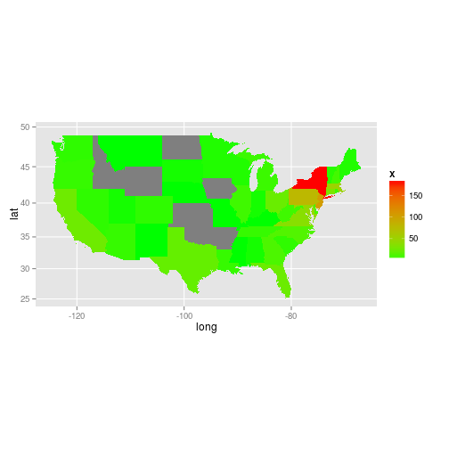
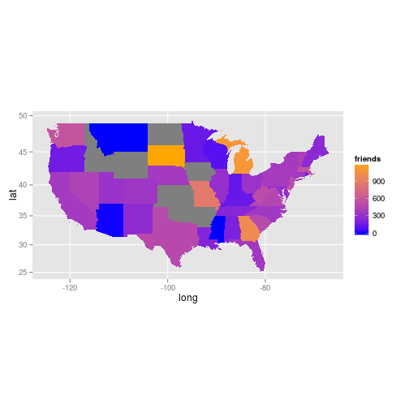

State-level aggregation
========================================================

This vignette demonstrates the geographical aggregation of 
point data, to create choropleth maps summarising twitter data.

## Load the state data


```r
library(rgdal)
```

```
## Loading required package: sp
## rgdal: version: 0.8-10, (SVN revision 478)
## Geospatial Data Abstraction Library extensions to R successfully loaded
## Loaded GDAL runtime: GDAL 1.10.0, released 2013/04/24
## Path to GDAL shared files: /usr/share/gdal/1.10
## Loaded PROJ.4 runtime: Rel. 4.8.0, 6 March 2012, [PJ_VERSION: 480]
## Path to PROJ.4 shared files: (autodetected)
```

```r
states <- readOGR(".", "states")
```

```
## OGR data source with driver: ESRI Shapefile 
## Source: ".", layer: "states"
## with 51 features and 5 fields
## Feature type: wkbPolygon with 2 dimensions
```

```r
summary(states)
```

```
## Object of class SpatialPolygonsDataFrame
## Coordinates:
##       min    max
## x -178.22 -66.97
## y   18.92  71.41
## Is projected: FALSE 
## proj4string :
## [+proj=longlat +datum=NAD83 +no_defs +ellps=GRS80 +towgs84=0,0,0]
## Data attributes:
##       STATE_NAME    DRAWSEQ       STATE_FIPS              SUB_REGION
##  Alabama   : 1   Min.   : 1.0   01     : 1   South Atlantic    : 9  
##  Alaska    : 1   1st Qu.:13.5   02     : 1   Mountain          : 8  
##  Arizona   : 1   Median :26.0   04     : 1   West North Central: 7  
##  Arkansas  : 1   Mean   :26.0   05     : 1   New England       : 6  
##  California: 1   3rd Qu.:38.5   06     : 1   East North Central: 5  
##  Colorado  : 1   Max.   :51.0   08     : 1   Pacific           : 5  
##  (Other)   :45                  (Other):45   (Other)           :11  
##    STATE_ABBR
##  AK     : 1  
##  AL     : 1  
##  AR     : 1  
##  AZ     : 1  
##  CA     : 1  
##  CO     : 1  
##  (Other):45
```

```r
states <- spTransform(states, CRS("+init=epsg:4326"))
states <- states[-which(grepl("Alask|Haw", as.character(states$STATE_NAME))), 
    ]
tweets <- read.csv("1pSample.txt")
plot(states)
points(tweets$lon, tweets$lat, col = "blue")
```

 


Convert the tweets into a spatial (S4) class


```r
tweets <- SpatialPointsDataFrame(coords = matrix(c(tweets$lon, tweets$lat), 
    ncol = 2), data = tweets, proj4string = CRS("+init=epsg:4326"))
```


Now lets aggregate by number of tweets.


```r
statesAg1 <- aggregate(tweets["X"], states, length)
```


Aggregating by average n. friends in territory:


```r
statesAg2 <- aggregate(tweets["actor.friendsCount"], by = states, mean)
statesAg1$friends <- statesAg2$actor.friendsCount
statesAg1$id <- as.character(states$STATE_NAME)
```


## Visualisation

Preparing the data to plot with ggplot2.


```r
library(ggplot2)
library(dplyr)
```

```
## 
## Attaching package: 'dplyr'
## 
## The following objects are masked from 'package:stats':
## 
##     filter, lag
## 
## The following objects are masked from 'package:base':
## 
##     intersect, setdiff, setequal, union
```

```r
sf <- fortify(statesAg1, region = "id")
```

```
## Loading required package: rgeos
## rgeos version: 0.2-19, (SVN revision 394)
##  GEOS runtime version: 3.3.8-CAPI-1.7.8 
##  Polygon checking: TRUE
```

```r
head(sf)
```

```
##     long   lat order  hole piece     group      id
## 1 -85.07 31.98     1 FALSE     1 Alabama.1 Alabama
## 2 -85.12 31.91     2 FALSE     1 Alabama.1 Alabama
## 3 -85.14 31.85     3 FALSE     1 Alabama.1 Alabama
## 4 -85.13 31.78     4 FALSE     1 Alabama.1 Alabama
## 5 -85.13 31.78     5 FALSE     1 Alabama.1 Alabama
## 6 -85.12 31.73     6 FALSE     1 Alabama.1 Alabama
```

```r
head(statesAg1@data)
```

```
##    X friends           id
## 1  5   573.6   Washington
## 2  1     0.0      Montana
## 3  3   250.0        Maine
## 4 NA      NA North Dakota
## 5  2  1194.5 South Dakota
## 6 NA      NA      Wyoming
```

```r
sf <- inner_join(sf, statesAg1@data, by = "id")
head(sf)
```

```
##     long   lat order  hole piece        group         id X friends
## 1 -122.4 48.23 10493 FALSE     1 Washington.1 Washington 5   573.6
## 2 -122.5 48.23 10494 FALSE     1 Washington.1 Washington 5   573.6
## 3 -122.5 48.13 10495 FALSE     1 Washington.1 Washington 5   573.6
## 4 -122.4 48.06 10496 FALSE     1 Washington.1 Washington 5   573.6
## 5 -122.5 48.13 10497 FALSE     1 Washington.1 Washington 5   573.6
## 6 -122.5 48.21 10498 FALSE     1 Washington.1 Washington 5   573.6
```


Plot.


```r
ggplot(sf, aes(long, lat, fill = X, group = group)) + geom_polygon() + scale_fill_gradient(low = "green", 
    high = "red") + coord_map()
```

 

```r

ggplot(sf, aes(long, lat, fill = friends, group = group)) + geom_polygon() + 
    scale_fill_gradient(low = "blue", high = "orange") + coord_map()
```

 


