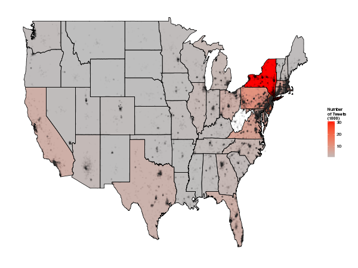

Analysis of Sandy Tweets paper
========================================================

```{r, echo=FALSE}
# TODO RL: space time bounds of density + hurricane impacts (cumulative) + counties level data
# TODO NR: word analysis sorted lite + add to the article
```


## Introduction - Research questions

- What proportion of the population tweeted about Sandy in different areas? 
- Is the temporal distribution of Sandy tweets different from all tweets? 
- How does this vary by distance to the eye? (we need a 'control' datasets of tweets for comparison  do we have one?) 
- Are 'hurricane tweets' in affected areas most likely before, after or during the storm? 
- What proportion of tweets about Hurricane Sandy link to climate change?
- How do tweets in affected areas differ from those outside?
- Bearing and distance analsis
- Spatio-temporal clustering by concern

A bit on open code - make available on GitHub?
Relation to previous work

## Data and methods

In order to track how different topics spread over time and
space as the hurricane advances, spatio-temporal clusting of tweets
was used ([Kisilevich et al., 2010](http://kdd.isti.cnr.it/~nanni/papers/DMKD_Handbook_STClustering_submitted.pdf)).
A number of techniques are available to estimate such 'moving clusters', ranging from
dot density algorithms applied over multiple time slices
- referred to as 'MC1' - to more sophisticated algorithms
designed to make use of the predictable behaviour of mass movement ([Kalnis et al., 2005](http://f3.tiera.ru/2/Cs_Computer%20science/CsLn_Lecture%20notes/A/Advances%20in%20Spatial%20and%20Temporal%20Databases,%209%20conf.,%20SSTD%202005%28LNCS3633,%20Springer,%202005%29%28ISBN%203540281274%29%28443s%29.pdf#page=374)). 
Although the datasets used in this paper may be deemed as 'large',
code efficiency is not a prime concern as the clustering need not
run repeatedly or in real time. Thus we use the MC1 algorithm for spatial clustering of
different tweet topics.

## Results

### Descriptive statistics of hurricane tweets

The spatial distribution of Sandy tweets is heavily biased
towards North America and Europe, with 80% originating in
Northern America and 77% originating in the USA (Table x).
It is interesting to note that the second most common
country of origin is the UK, which is not close to the USA
geographically but which has a high uptake of Twitter (ref)
and is close culturally to North America (ref).

Table x: Summary of the continents, subregions and countries of tweet origins.

|        continent       |             subregion       |          country        |
|:-----------------------|:----------------------------|:------------------------|
|North America:132574    |Northern America  :129427    |United States :125002    |
|Europe       : 12443    |Northern Europe   :  6780    |United Kingdom:  5725    |
|South America:  5907    |South America     :  5907    |Canada        :  4421    |
|Asia         :  4710    |Southern Europe   :  2847    |Brazil        :  3046    |
|Africa       :  1256    |South-Eastern Asia:  2716    |Spain         :  1817    |
|(Other)      :   742    |(Other)           :  9955    |(Other)       : 17621    |
|NA's         :  4711    |NA's              :  4711    |NA's          :  4711    |

Because of the dominance of the USA in the global dataset and the fact that it was this
country which was most affected by Sandy, we focussed the majority of the analysis on
tweets originating from the USA. This subset of the data is summarised graphically in Figure x.



### Spatial patterns in the data

### Dynamics of hurricane tweets

### Spatio-temporal analysis

## Discussion and conclustions

## References

Kalnis, P., Mamoulis, N., & Bakiras, S. (2005). On Discovering Moving Clusters in Spatio-temporal Data. In Proceedings of the 9th International Conference on Advances in Spatial and Temporal Databases (pp. 364–381). doi:10.1007/11535331 21

Kisilevich, S., Mansmann, F., Nanni, M., & Rinzivillo, S. (2010). Spatio-Temporal Clustering: a Survey. Data Mining and Knowledge Discovery Handbook, 1–22. doi:10.1007/978-0-387-09823-4

