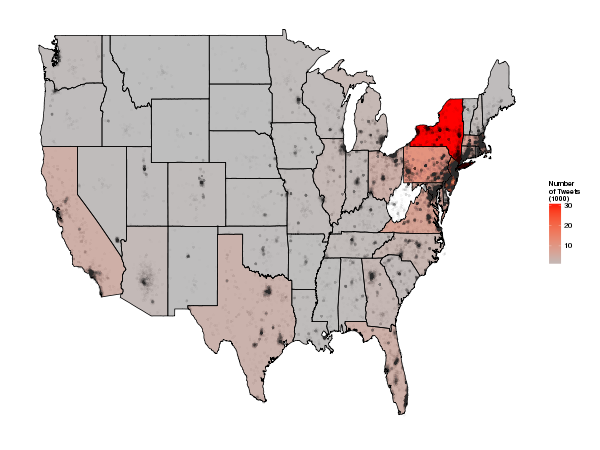

Analysis of Sandy Tweets paper
========================================================

## Introduction - Research questions

- What proportion of the population tweeted about Sandy in different areas? 
- Is the temporal distribution of Sandy tweets different from all tweets? 
- How does this vary by distance to the eye? (we need a 'control' datasets of tweets for comparison  do we have one?) 
- Are 'hurricane tweets' in affected areas most likely before, after or during the storm? 
- What proportion of tweets about Hurricane Sandy link to climate change?
- How do tweets in affected areas differ from those outside?
- Bearing and distance analsis
- Spatio-temporal clustering by concern

A bit on open code - make available on GitHub?
Relation to previous work

## Data and methods

## Results

### Descriptive statistics of hurricane tweets

The spatial distribution of Sandy tweets is heavily biased
towards North America and Europe, with 80% originating in
Northern America and 77% originating in the USA (Table x).
It is interesting to note that the second most common
country of origin is the UK, which is not close to the USA
geographically but which has a high uptake of Twitter (ref)
and is close culturally to North America (ref).

Table x: Summary of the continents, subregions and countries of tweet origins.

|        continent       |             subregion       |          country        |
|:-----------------------|:----------------------------|:------------------------|
|North America:132574    |Northern America  :129427    |United States :125002    |
|Europe       : 12443    |Northern Europe   :  6780    |United Kingdom:  5725    |
|South America:  5907    |South America     :  5907    |Canada        :  4421    |
|Asia         :  4710    |Southern Europe   :  2847    |Brazil        :  3046    |
|Africa       :  1256    |South-Eastern Asia:  2716    |Spain         :  1817    |
|(Other)      :   742    |(Other)           :  9955    |(Other)       : 17621    |
|NA's         :  4711    |NA's              :  4711    |NA's          :  4711    |

Because of the dominance of the USA in the global dataset and the fact that it was this
country which was most affected by Sandy, we focussed the majority of the analysis on
tweets originating from the USA. This subset of the data is summarised graphically in Figure x.

### Spatial patterns in the data

### Dynamics of hurricane tweets

### Spatio-temporal analysis

## Discussion and conclustions

